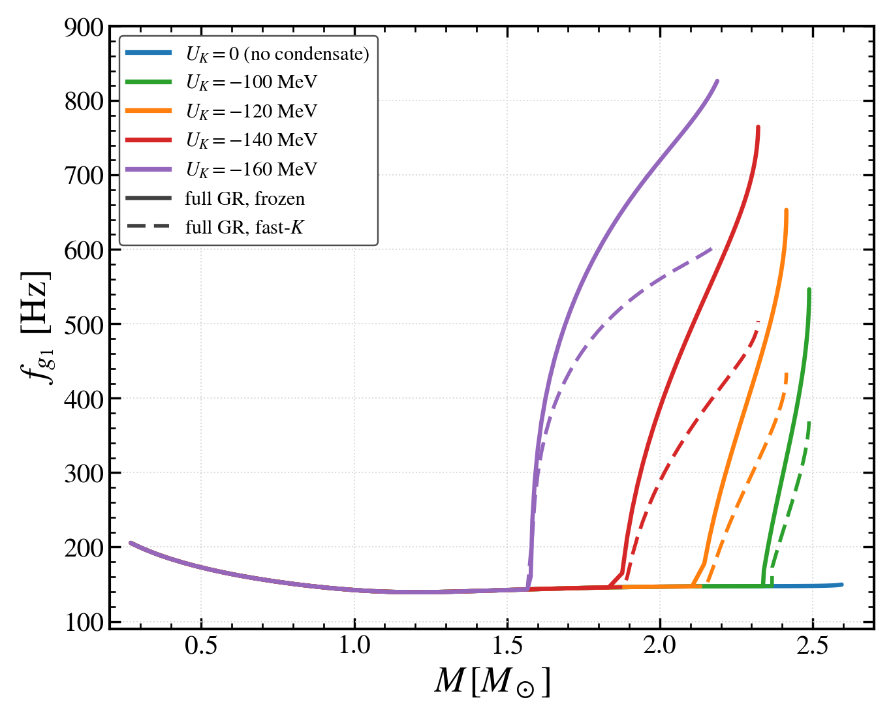

# Reaction-constrained neutron-star g-mode data

[](https://github.com/prashantstar123/reaction-constrained-gmode-data/actions/workflows/reproduce.yml)
[](https://arxiv.org/abs/2607.20693)
[](docs/MANUAL.md)

**Full-GR composition g-mode frequencies, radiative damping times and
reaction-limit comparisons. Reproduce 9 figures and 8 tables with one command.**

Saved numerical results and data-only reproduction scripts for
**Reaction-constrained composition g-modes in neutron stars with antikaon
condensates, hyperons, and Delta(1232) resonances**, by
[Prashant Thakur](https://github.com/prashantstar123) and
Ishfaq Ahmad Rather ([@ishfaq333](https://github.com/ishfaq333)).

Accepted in *Physical Review D*.
[Assigned journal DOI](https://doi.org/10.1103/146c-y868) |
[Preprint](https://arxiv.org/abs/2607.20693) |
[Download v1.0.0](https://github.com/prashantstar123/reaction-constrained-gmode-data/releases/tag/v1.0.0) |
[Manual](docs/MANUAL.md) | [Data dictionary](docs/DATA_DICTIONARY.md)



*Paper Figure 3a: full-GR composition-mode frequencies in the frozen and
fast-kaon limits. The package regenerates this plot from saved numerical data.*

## One-command reproduction

On Linux with Python 3.11 or 3.12:

```bash
git clone https://github.com/prashantstar123/reaction-constrained-gmode-data.git
cd reaction-constrained-gmode-data
bash reproduce.sh
```

Alternatively, download the versioned ZIP from the release page, extract it,
open the extracted directory, and run `bash reproduce.sh`.

The command installs the pinned dependencies into a local `.venv`, checks
input hashes, and regenerates **9 numbered figures and 8 tables** from the
saved data. Figures 3 and 6 each comprise two image files, so the output
contains **11 PNGs and 11 vector PDFs**. The last line must begin `PASS`.

No stellar solver, GPU, cluster, account or TeX installation is needed.
Internet access is needed only for the initial dependency installation.

The verified package has **9 regression tests**, **282 matching table cells**
and SHA-256 checks for **27 input/reference files**. A fresh installation on
an independent desktop reproduced all **49 output files** byte-for-byte under
the pinned environments. See the [verification record](docs/VERIFICATION.md)
for the tested scope and the workflow badge above for current GitHub checks.

## Contents

The data cover BigApple equilibrium sequences, composition and buoyancy,
full-GR fundamental composition-mode frequencies and radiative damping,
frozen versus fast-kaon/strong-Delta limits, channel sensitivities, and the
DD-ME2 appendix comparison. The tidal records retain the paper's leading-order
resonance estimates and their stated qualifications.

This package **reproduces the presentation of saved numerical results**.
It does not recompute EOSs, stellar backgrounds, eigenfunctions or QNM roots.
Those solver implementations and private research records are excluded.

Exact-star table records are distinct from mass-sequence plotting grids.
The damping plots retain their archived onset splicing, reliability cuts,
display caps and log smoothing. Unprocessed saved damping arrays remain
available alongside the data-only processing code. Two last-digit table
presentation choices are explicitly recorded without changing the underlying
checkpoint values. See [provenance](docs/PROVENANCE.md).

The table files use the numbering requested in the sent proof corrections:
the hyperon/Delta structural summary is Table V and its channel decomposition
is Table VI. No table values are altered by this numbering change.

## Outputs and documentation

- `output/figures/`: eleven PNG/PDF asset pairs and their plotted-coordinate records.
- `output/tables/`: eight LaTeX row files and eight labelled JSON tables.
- `output/verification.json`: numerical checks, versions and output hashes.
- [Manual](docs/MANUAL.md): setup, commands, figure/table map and troubleshooting.
- [Data dictionary](docs/DATA_DICTIONARY.md): units, fields and selection rules.
- [Provenance](docs/PROVENANCE.md): source distinctions and display conventions.
- [Verification](docs/VERIFICATION.md): tested scope and clean-download results.
- [Citation metadata](CITATION.cff) and [rights notice](LICENSE-NOTICE.md).

Original paper images in `reference/paper_figures/` are comparison fixtures;
the plotting code never reads them to generate output.

After installation, offline checks are:

```bash
.venv/bin/python -m reproduction
.venv/bin/python -m reproduction --verify-only
.venv/bin/python -m unittest discover -s tests -v
```

The paper, its numerical content and the private solver are not modified by
running these commands.

## Cite and reuse

Please cite the associated article, linked above, and identify the data-release
version used. Machine-readable metadata is provided in [CITATION.cff](CITATION.cff)
and through GitHub's **Cite this repository** button.

Public access does not add a reuse license; see the [rights notice](LICENSE-NOTICE.md).
The source code for the full-GR stellar-oscillation solver may be made available
by the corresponding author upon reasonable request. It is not included here.

## Questions and related data

Use [GitHub Issues](https://github.com/prashantstar123/reaction-constrained-gmode-data/issues)
for reproduction problems or questions about the released data. Include your
Python version, command and error message; see [CONTRIBUTING.md](CONTRIBUTING.md).
If this package is useful, a star or a link from your related work helps other
researchers find it.

Related repository: [two-fluid f-mode data](https://github.com/prashantstar123/two-fluid-fmode-data),
a separate study of dark-matter-admixed neutron stars.
